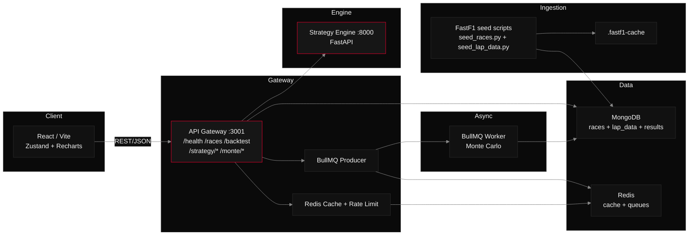

# 🏎️ F1 Strategy Simulator

> Race Strategy Optimization & Analysis Platform — model, simulate, and backtest Formula 1 pit stop strategies using real historical data.

   

---

## 📌 Overview

During a Grand Prix, a team's Strategy Wall must evaluate tire degradation, gap management, pit windows, and safety car probability — often in under 30 seconds. This project brings that analysis to the browser.

**F1 Strategy Simulator** is a full-stack web application that:
- Models lap time degradation using compound-specific power curves
- Computes optimal 1-stop and 2-stop pit windows
- Detects undercut / overcut opportunities
- Runs Monte Carlo safety car simulations (up to 5000 iterations)
- Backtests model recommendations against actual historical race strategies

No coding required. Run a full strategy simulation in under 2 minutes.

---

## ✨ Features

| Feature | Description |
|---|---|
| **Race Selector** | Select seeded races from the FastF1 schedule |
| **Strategy Engine** | Optimal pit lap computation for 1-stop and 2-stop strategies |
| **Undercut Detector** | Identifies the lap range where pitting first yields a net positive gap |
| **Monte Carlo Sim** | SC probability-weighted strategy win distribution over N iterations |
| **Backtest Mode** | Compare model recommendation vs historical strategy |
| **Live Charts** | Degradation, undercut window, and Monte Carlo distribution charts |

---

## 🏗️ Architecture



### Services

| Service | Language | Port | Responsibility |
|---|---|---|---|
| React Frontend | TypeScript | 5173 | Strategy simulator UI |
| API Gateway | Node.js 20 | 3001 | Routing, caching, BullMQ producer |
| Strategy Engine | Python 3.11 | 8000 | Pit window calc, deg model, undercut |
| BullMQ Worker | Node.js 20 | — | Async Monte Carlo processing |
| MongoDB | MongoDB 7 | 27017 | Races, lap data, and async results |
| Redis | Redis 7 | 6379 | Response cache + queue backend |

---

## 🧮 Mathematical Model

### Lap Time Degradation

Lap time at tyre age `t` is modelled with a fitted power curve:

```
T(t) = B + k × t^1.4

  B    = base pace (fastest lap on new tyre, seconds)
  k    = compound degradation coefficient
  t    = tyre age in laps
  1.4  = empirically fitted exponent (range 1.3–1.5)
```

Default `k` values fitted from Ergast 2021–2023 data:

| Compound | k |
|---|---|
| SOFT | 0.085 |
| MEDIUM | 0.045 |
| HARD | 0.022 |

### Optimal Pit Window

```
Time_1stop(P) = Σ T_c1(t) for t in 1..P        # stint 1
              + D                                # pit delta
              + Σ T_c2(t) for t in 1..(L-P)     # stint 2

P* = argmin Time_1stop(P)  where P ∈ [MIN_STINT, L - MIN_STINT]
MIN_STINT = 10 laps
```

For 2-stop: brute-force search over all (P1, P2) pairs — O(L²), max ~3600 combinations for a 60-lap race.

### Undercut Detection

```
undercut_gain(P) = T_rival(lap P, old tyre)
                 - T_self(lap P+1, new tyre)
                 - pit_delta

Undercut window = { P : undercut_gain(P) > 0 }
```

### Monte Carlo Safety Car Simulation

```python
for i in range(N):
    sc_laps = {lap for lap in range(1, L+1) if random() < sc_probability}

    for strategy in candidates:
        time = compute_time(strategy, sc_laps)  # free pit if pit_lap in sc_laps

    win_counts[argmin(times)] += 1

win_pct[s] = win_counts[s] / N
```

---

## 📡 API Reference

### API Gateway `:3001`

| Method | Endpoint | Description |
|---|---|---|
| `GET` | `/api/races` | List races (filter by `season`) |
| `POST` | `/api/strategy/compute` | Synchronous pit window computation (<3s) |
| `POST` | `/api/monte/run` | Enqueue Monte Carlo job → returns `job_id` |
| `GET` | `/api/monte/result/:jobId` | Poll MC job result |
| `GET` | `/api/backtest?raceId=YYYY-R` | Backtest for a race |

### Strategy Engine `:8000`

| Method | Endpoint | Body | Response |
|---|---|---|---|
| `POST` | `/compute` | `{ base_pace_s, pit_delta_s, total_laps, stop_count, compounds }` | `{ optimal, undercut_window, all_1stop_times, all_2stop_times }` |
| `POST` | `/pit-window` | `{ base_pace_s, pit_delta_s, total_laps, target_lap, compound_old, compound_new, rival_tyre_age }` | `{ gain_s, is_undercut, is_overcut }` |
| `POST` | `/monte-carlo` | `{ base_pace_s, pit_delta_s, total_laps, sc_probability, n_iterations, compounds }` | `{ distribution: [{ strategy, win_pct }] }` |
| `GET` | `/health` | — | `{ status: "ok" }` |

Interactive docs available at `http://localhost:8000/docs` (FastAPI Swagger UI).

---

## 🗂️ Project Structure

```
f1-strategy-simulator/
├── frontend/                    # React 18 + Vite + TypeScript
│   └── src/
│       ├── components/          # Shared UI components
│       ├── pages/               # SimulatorPage, MonteCarloPage, BacktestPage
│       ├── stores/              # Zustand stores (useSimStore.ts)
│       ├── api/                 # Axios client wrappers
│       └── utils/               # Chart formatters, constants
│
├── api-gateway/                 # Node.js / Express
│   └── src/
│       ├── routes/              # races, strategy, monte, backtest
│       ├── middleware/          # rate-limit, Redis cache, error handler
│       ├── services/            # strategyEngineClient, openF1Client
│       ├── workers/             # BullMQ worker
│       └── db/                  # Mongoose models
│
├── strategy-engine/             # Python 3.11 / FastAPI
│   └── app/
│       ├── models/              # Pydantic request/response schemas
│       ├── core/                # deg_model.py, pit_window.py, monte_carlo.py
│       └── routers/             # /compute, /pit-window, /monte-carlo
│
├── scripts/
│   ├── seed_races.py            # FastF1 race schedule ingestion
│   ├── seed_lap_data.py         # FastF1 lap data ingestion
│   ├── seed_races.js            # Node shim → seed_races.py
│   ├── seed_lap_data.js         # Node shim → seed_lap_data.py
│   └── requirements.txt         # Python deps (fastf1, pymongo, python-dotenv)
│
├── api-gateway/Dockerfile       # Build api-gateway image
├── strategy-engine/Dockerfile   # Build strategy-engine image
├── frontend/Dockerfile          # Build frontend image
├── frontend/nginx.conf          # Nginx config for SPA routing
└── docker-compose.yml           # Full stack: Mongo + Redis + services
```

---

## 🚀 Getting Started

### Prerequisites

- Node.js 20+
- Python 3.11+
- Docker & Docker Compose (for local Mongo + Redis)

### Option A: Local Development (Recommended for Active Development)

#### 1. Clone & install

```bash
git clone https://github.com/rayan-1005/f1-strategy-simulator
cd f1-strategy-simulator

# Frontend
cd frontend && npm install

# API Gateway
cd ../api-gateway && npm install

# Strategy Engine
cd ../strategy-engine && pip install -r requirements.txt

# Scripts
cd ../scripts && pip install -r requirements.txt
```

#### 2. Start infrastructure

```bash
docker-compose up -d   # starts MongoDB + Redis only
```

#### 3. Seed race data

```bash
cd scripts
node seed_races.js       # pulls 2018-2024 race list via FastF1
node seed_lap_data.js    # pulls lap data via FastF1 (can take a while)
```

On Windows, point the shim at your venv if needed:
```powershell
$env:PYTHON="path\to\.venv\Scripts\python.exe"
```

Optional flags:
```bash
node seed_races.js --start=2021 --end=2024
node seed_lap_data.js --season=2024
node seed_lap_data.js --season=2024 --round=1
```

#### 4. Run all services (3 terminals)

```bash
# Terminal 1 — Strategy Engine
cd strategy-engine && uvicorn app.main:app --reload --port 8000

# Terminal 2 — API Gateway + BullMQ Worker
cd api-gateway && npm run dev

# Terminal 3 — Frontend
cd frontend && npm run dev
```

Open [http://localhost:5173](http://localhost:5173)

#### Environment Variables

Create `api-gateway/.env`:

```env
MONGO_URL=mongodb://localhost:27017/f1sim
REDIS_URL=redis://localhost:6379
STRATEGY_ENGINE_URL=http://localhost:8000
PORT=3001
```

---

### Option B: Full Docker (Recommended for Production/Demo)

#### 1. Build services

```bash
# Build all
npm run build         # api-gateway
cd ../frontend && npm run build
cd ..
```

#### 2. Seed data (before docker-compose)

```bash
cd scripts
node seed_races.js --start=2021 --end=2024
node seed_lap_data.js --season=2021
node seed_lap_data.js --season=2022
node seed_lap_data.js --season=2023
node seed_lap_data.js --season=2024
```

(Or skip for demo: default fallback data in Backtest page)

#### 3. Start all services

```bash
docker-compose up
```

Access:
- **Frontend:** `http://localhost`
- **API Gateway:** `http://localhost:3001`
- **Strategy Engine:** `http://localhost:8000`

---

### Environment Variables (Docker)

Set in `api-gateway/.env` or pass to Docker:

```env
MONGO_URL=mongodb://mongo:27017/f1sim
REDIS_URL=redis://redis:6379
STRATEGY_ENGINE_URL=http://strategy-engine:8000
PORT=3001
```

Services communicate via docker network `f1sim-network`.

---

## 📦 Tech Stack

| Layer | Technology |
|---|---|
| Frontend | React 18, Vite, TypeScript, Zustand, Recharts |
| API Gateway | Node.js 20, Express, BullMQ, Mongoose |
| Strategy Engine | Python 3.11, FastAPI, NumPy, SciPy |
| Database | MongoDB Atlas (M0 free tier) |
| Cache / Queue | Redis (Upstash free tier) |
| External Data | [FastF1](https://theoehrly.github.io/Fast-F1/) |
| Deployment | Vercel (frontend), Render (backend services) |

---

## 🗓️ Roadmap

- [x] Project proposal & architecture design
- [ ] Week 1 — Data pipeline (Ergast + OpenF1 ingestion, MongoDB schema)
- [ ] Week 2 — Strategy engine V1 (degradation model, pit window endpoint)
- [ ] Week 3 — Monte Carlo module (safety car sim)
- [ ] Week 4 — React frontend MVP (sliders, charts, recommendation panel)
- [ ] Week 5 — Backtest module (sim vs. actual for 5 races)
- [ ] Week 6 — Polish, deployment, demo video

---

## 📊 Performance Targets

| Metric | Target |
|---|---|
| Strategy computation latency | < 3s P95 |
| Page initial load | < 2s on 4G |
| Monte Carlo (N=1000) | < 5s |
| Backtest accuracy | ±2 laps of actual optimal in 8/10 test races |
| Browser support | Chrome 110+, Firefox 115+, Safari 16+ |

---

## 🧪 Testing

```bash
# Strategy engine unit tests
cd strategy-engine && pytest tests/ -v

# API Gateway integration tests
cd api-gateway && npm test
```

Backtest validation: 10 reference races (2021–2023) with known strategies serve as ground truth. Model passes if predicted optimal pit lap falls within ±2 laps of the race-winning strategy in ≥8/10 cases.

---

## 📄 License

MIT © 2026 Rayan
